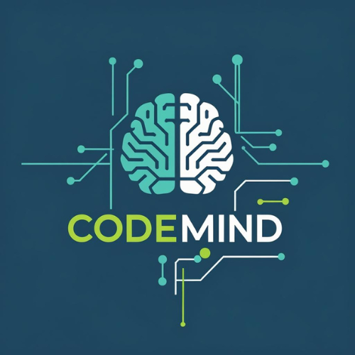

# 🤖 CodeMind AI

<div align="center">



**Nền tảng học lập trình thông minh dành cho người Việt**

Học code qua game, thử thách và AI trợ giảng 24/7

[](https://courseai-platform-two.vercel.app)
[](https://reactjs.org/)
[](https://www.typescriptlang.org/)
[](https://tailwindcss.com/)

</div>

---

## 📖 Giới thiệu

**CodeMind AI** là nền tảng học lập trình gamification đầu tiên tại Việt Nam, kết hợp giữa học tập và giải trí. Người dùng có thể học các ngôn ngữ lập trình phổ biến như Python, JavaScript, React, SQL... thông qua các khóa học tương tác, mini-games và hệ thống phần thưởng hấp dẫn.

## ✨ Tính năng nổi bật

### 🎓 Học tập
- **15+ Khóa học** - Python, JavaScript, React, SQL, Machine Learning, Docker, Git...
- **Lộ trình học tập** - Roadmap chi tiết từ cơ bản đến nâng cao
- **Code Playground** - Viết và chạy code trực tiếp trên trình duyệt (Python, JavaScript, HTML)
- **AI Assistant** - Trợ giảng thông minh hỗ trợ giải đáp 24/7

### 🎮 Gamification
- **Code Hero Adventure** - Game phiêu lưu học lập trình
- **Java Ninja** - Game ninja học Java
- **Dungeon Code Quest** - Khám phá dungeon qua code
- **Treasure Hunt** - Săn kho báu, giải câu đố lập trình

### 🏆 Hệ thống phần thưởng
- **XP & Level** - Tích lũy kinh nghiệm, lên cấp
- **Xu (Coins)** - Tiền tệ trong game để mua khóa học
- **Daily Rewards** - Điểm danh nhận thưởng hàng ngày
- **Lucky Wheel** - Vòng quay may mắn
- **Daily Quests** - Nhiệm vụ hàng ngày
- **Achievements** - Hệ thống thành tựu

### 👥 Cộng đồng
- **Social Feed** - Chia sẻ tiến độ học tập
- **Friends System** - Kết bạn và chat
- **Leaderboard** - Bảng xếp hạng

## 🖼️ Screenshots

| Trang chủ | Khóa học | Game |
|-----------|----------|------|
|  |  |  |

## 🛠️ Tech Stack

### Frontend
- **React 18** - UI Library
- **TypeScript** - Type Safety
- **Vite** - Build Tool
- **Tailwind CSS** - Styling
- **Lucide React** - Icons

### Backend
- **Supabase** - Backend as a Service
  - PostgreSQL Database
  - Authentication
  - Real-time subscriptions
  - Edge Functions
  - Storage

### Deployment
- **Vercel** - Hosting & CI/CD

## 🚀 Cài đặt & Chạy

### Yêu cầu
- Node.js 18+
- npm hoặc yarn
- Tài khoản Supabase

### Bước 1: Clone repo
```bash
git clone https://github.com/your-username/codemind-ai.git
cd codemind-ai
```

### Bước 2: Cài đặt dependencies
```bash
npm install
```

### Bước 3: Cấu hình môi trường
Tạo file `.env` từ `.env.example`:
```bash
cp .env.example .env
```

Điền thông tin Supabase:
```env
VITE_SUPABASE_URL=your_supabase_url
VITE_SUPABASE_ANON_KEY=your_supabase_anon_key
```

### Bước 4: Chạy development server
```bash
npm run dev
```

Truy cập http://localhost:5173

## 📁 Cấu trúc dự án

```
codemind-ai/
├── public/              # Static assets
├── src/
│   ├── components/      # React components
│   │   ├── AIAssistant.tsx
│   │   ├── Courses.tsx
│   │   ├── CodePlayground.tsx
│   │   ├── DailyRewards.tsx
│   │   ├── GameCategories.tsx
│   │   └── ...
│   ├── contexts/        # React contexts
│   ├── hooks/           # Custom hooks
│   ├── lib/             # Utilities & Supabase client
│   ├── App.tsx          # Main app component
│   └── main.tsx         # Entry point
├── supabase/
│   ├── migrations/      # Database migrations
│   ├── functions/       # Edge functions
│   └── email-templates/ # Email templates
└── ...config files
```

## 🔗 Demo

👉 **Truy cập ngay:** [https://courseai-platform-two.vercel.app](https://courseai-platform-two.vercel.app)

## 🤝 Đóng góp

Mọi đóng góp đều được chào đón! Vui lòng:

1. Fork repo
2. Tạo branch mới (`git checkout -b feature/AmazingFeature`)
3. Commit changes (`git commit -m 'Add some AmazingFeature'`)
4. Push to branch (`git push origin feature/AmazingFeature`)
5. Mở Pull Request

## 📄 License

Dự án này được bảo vệ bởi giấy phép độc quyền. Xem file [LICENSE](LICENSE) để biết thêm chi tiết.

## 👨‍💻 Tác giả

**MAI TRAN THIEN TAM**

- GitHub: [@your-github](https://github.com/your-github)
- Email: your-email@example.com

---

<div align="center">

⭐ **Nếu thấy hữu ích, hãy cho repo một star nhé!** ⭐

⚠️ **Lưu ý**: Đây là phần mềm có bản quyền. Vui lòng đọc LICENSE trước khi sử dụng.

</div>
